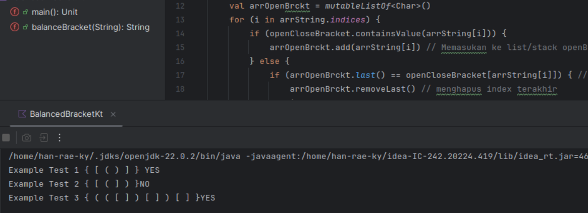

# Balanced Bracket

## Question 2

Below is a screenshot illustrating the solution for Question 2.

## Kompleksitas Fungsi

- **Kompleksitas Waktu (Time Complexity)**: O(n)  
  Fungsi ini melakukan iterasi sekali melalui setiap karakter dalam string input dengan panjang `n`. Karena setiap operasi pada list `arrOpenBrckt` dilakukan dalam waktu konstan **O(1)**, kompleksitas waktu keseluruhan adalah **O(n)**.

- **Kompleksitas Ruang (Space Complexity)**: O(n)  
  Dalam kasus terburuk, semua tanda kurung buka akan disimpan di list `arrOpenBrckt`, sehingga kompleksitas ruangnya adalah **O(n)**.

## Contoh Kasus

Untuk input `{ [ ( ] ) }`, langkah-langkah eksekusi adalah:
- String dibaca dan setiap karakter diproses untuk melihat apakah sesuai dengan aturan keseimbangan tanda kurung.
- Proses akan berhenti pada tanda kurung `]`, yang tidak sesuai dengan elemen terakhir `(` dalam list `arrOpenBrckt`, menghasilkan output "NO".

